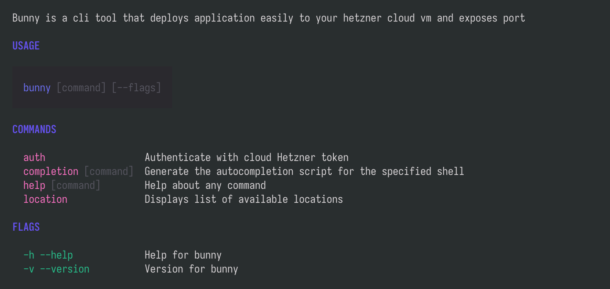

# bunny

Bunny is a fast, ligthweight cli tool that enables deployment of a docker application
to Hetzner, exposing the port and eventually providing a usable url.

On installation, `~/.bunny/` is created in home directory.

## Commands

`bunny --help`

> Disclaimer: This documentation will be updated
> overtime. Tool is a work in progress
